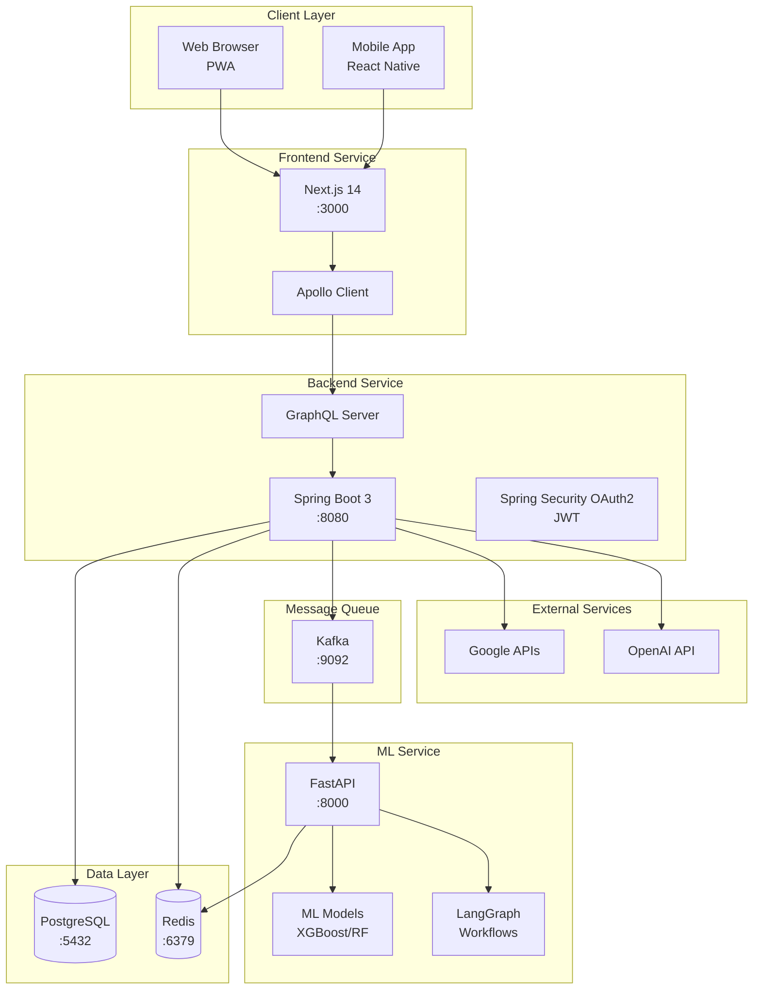

# Geulpi Calendar Service - System Architecture

## 목차
1. [서비스 개요](#서비스-개요)
2. [시스템 아키텍처](#시스템-아키텍처)
3. [기술 스택](#기술-스택)
4. [디렉토리 구조](#디렉토리-구조)
5. [서비스 간 통신](#서비스-간-통신)
6. [데이터 흐름](#데이터-흐름)
7. [보안 및 인증](#보안-및-인증)
8. [배포 전략](#배포-전략)

## 서비스 개요

Geulpi는 AI 기반 대화형 캘린더 서비스로, 사용자가 자연어로 일정을 관리하고 라이프 밸런스를 유지할 수 있도록 돕습니다.

### 핵심 기능
- 🗨️ 대화형 일정 관리 (자연어 처리)
- 📊 라이프 밸런스 분석 및 인사이트
- 🤖 AI 기반 일정 최적화 제안
- 📷 이미지 기반 일정 입력 (OCR)
- 🔄 실시간 동기화 및 협업

## 시스템 아키텍처



## 기술 스택

### Frontend
- **Framework**: Next.js 14 (App Router)
- **Language**: TypeScript
- **Styling**: Tailwind CSS + shadcn/ui
- **State Management**: Apollo Client
- **Calendar**: react-big-calendar
- **Auth**: NextAuth.js
- **PWA**: next-pwa

### Backend
- **Framework**: Spring Boot 3.2.5
- **Language**: Java 21
- **Build Tool**: Gradle (Kotlin DSL)
- **API**: GraphQL (Spring GraphQL)
- **Auth**: Spring Security OAuth2 + JWT
- **ORM**: Spring Data JPA
- **DB Migration**: Liquibase
- **Cache**: Spring Cache + Redis
- **Message Queue**: Spring Kafka

### ML Server
- **Framework**: FastAPI
- **Language**: Python 3.11
- **Workflow**: LangGraph
- **ML Libraries**: Scikit-learn, XGBoost
- **Data Processing**: Pandas, NumPy
- **Cache**: Redis
- **Message Queue**: Kafka

### Infrastructure
- **Database**: PostgreSQL 15 (Docker Container)
- **Cache**: Redis 7 (Docker Container)
- **Message Queue**: Apache Kafka (Docker Container)
- **Container**: Docker + Docker Compose
- **Reverse Proxy**: Nginx
- **Monitoring**: Prometheus + Grafana

## 디렉토리 구조

```
geulpi-project-1/
├── 📄 README.md                    # 프로젝트 개요
├── 📄 architecture.md              # 이 문서
├── 📄 CLAUDE.md                    # Root 오케스트레이터 가이드
├── 📄 schema.graphql               # 🔒 Single Source of Truth
├── 📄 docker-compose.yml           # 전체 서비스 통합
├── 📄 docker-compose.dev.yml       # 개발 환경 설정
├── 📄 docker-compose.test.yml      # 통합 테스트 환경
├── 📄 .env.example                 # 환경 변수 템플릿
├── 📄 .gitignore
│
├── 📁 frontend/                    # Next.js Frontend
│   ├── 📄 CLAUDE.md               # Frontend 가이드
│   ├── 📄 package.json
│   ├── 📄 Dockerfile
│   ├── 📄 docker-compose.yml      # Frontend 단독 개발용
│   ├── 📁 app/                    # App Router
│   │   ├── 📁 (auth)/            # 인증 라우트 그룹
│   │   ├── 📁 (protected)/       # 보호된 라우트
│   │   ├── 📁 api/               # API 라우트
│   │   └── 📄 layout.tsx
│   ├── 📁 components/             # React 컴포넌트
│   │   ├── 📁 calendar/
│   │   ├── 📁 chat/
│   │   ├── 📁 dashboard/
│   │   └── 📁 ui/                # shadcn/ui
│   ├── 📁 graphql/                # GraphQL 쿼리/뮤테이션
│   ├── 📁 generated/              # Codegen 출력
│   ├── 📁 lib/                    # 유틸리티
│   └── 📁 public/                 # 정적 파일
│
├── 📁 backend/                     # Spring Boot Backend
│   ├── 📄 CLAUDE.md               # Backend 가이드
│   ├── 📄 build.gradle.kts        # Gradle 빌드 설정
│   ├── 📄 settings.gradle.kts     # Gradle 설정
│   ├── 📄 Dockerfile
│   ├── 📄 docker-compose.yml      # Backend + DB 개발용
│   ├── 📁 src/
│   │   ├── 📁 main/
│   │   │   ├── 📁 java/com/geulpi/
│   │   │   │   ├── 📁 config/    # 설정 클래스
│   │   │   │   ├── 📁 entity/    # JPA 엔티티
│   │   │   │   ├── 📁 repository/
│   │   │   │   ├── 📁 service/
│   │   │   │   ├── 📁 resolver/  # GraphQL Resolver
│   │   │   │   ├── 📁 security/  # 보안 설정
│   │   │   │   ├── 📁 kafka/     # Kafka 통신
│   │   │   │   └── 📁 external/  # 외부 API 클라이언트
│   │   │   └── 📁 resources/
│   │   │       ├── 📄 application.yml
│   │   │       └── 📁 db/changelog/  # Liquibase
│   │   └── 📁 test/
│   └── 📁 target/
│
├── 📁 ml-server/                   # FastAPI ML Server
│   ├── 📄 CLAUDE.md               # ML Server 가이드
│   ├── 📄 requirements.txt
│   ├── 📄 Dockerfile
│   ├── 📄 docker-compose.yml      # ML + Redis 개발용
│   ├── 📄 main.py                 # 메인 애플리케이션
│   ├── 📄 kafka_handler.py        # Kafka 처리
│   ├── 📄 train_models_enhanced.py
│   ├── 📁 models/                 # ML 모델
│   │   ├── 📄 classifiers.py
│   │   ├── 📄 optimizer.py
│   │   ├── 📄 pattern_detector.py
│   │   ├── 📄 burnout_predictor.py
│   │   └── 📁 trained/           # 학습된 모델
│   ├── 📁 workflows/              # LangGraph 워크플로우
│   │   ├── 📄 event_classification.py
│   │   ├── 📄 schedule_optimization.py
│   │   └── 📄 pattern_detection.py
│   └── 📁 tests/
│
├── 📁 nginx/                       # Nginx 리버스 프록시
│   ├── 📄 nginx.conf              # Nginx 설정
│   ├── 📄 Dockerfile
│   └── 📁 ssl/                    # SSL 인증서
│       └── 📄 generate-ssl.sh     # 개발용 자체 서명 인증서 생성
│
├── 📁 scripts/                     # 유틸리티 스크립트
│   ├── 📄 setup.sh                # 초기 설정
│   ├── 📄 health-check.sh         # 헬스 체크
│   └── 📄 deploy.sh               # 배포 스크립트
│
└── 📁 docs/                        # 추가 문서
    ├── 📄 api-spec.md             # API 명세
    ├── 📄 deployment.md           # 배포 가이드
    └── 📄 troubleshooting.md      # 문제 해결
```

## 서비스 간 통신

### 1. Frontend ↔ Backend
- **Protocol**: GraphQL over HTTP/WebSocket
- **Endpoint**: `http://backend:8080/graphql`
- **Authentication**: JWT Bearer Token
- **Real-time**: GraphQL Subscriptions (WebSocket)

```graphql
# Query 예시
query GetEvents($startDate: DateTime!, $endDate: DateTime!) {
  events(startDate: $startDate, endDate: $endDate) {
    id
    title
    startTime
    endTime
    category
  }
}

# Mutation 예시
mutation ChatWithEventManagement($input: String!) {
  chatWithEventManagement(input: $input) {
    message
    events {
      id
      title
    }
  }
}

# Subscription 예시
subscription OnEventUpdate($userId: ID!) {
  eventUpdated(userId: $userId) {
    id
    title
    status
  }
}
```

### 2. Backend ↔ ML Server
- **Protocol**: Apache Kafka
- **Topics**: 
  - `ml-requests`: Backend → ML Server
  - `ml-responses`: ML Server → Backend
- **Format**: JSON
- **Timeout**: 30초

```json
// ml-requests 메시지 예시
{
  "requestId": "uuid",
  "type": "CLASSIFY_EVENT",
  "data": {
    "text": "내일 오후 2시 회의",
    "features": [0.8, 0.2, 0.5, ...]
  }
}

// ml-responses 메시지 예시
{
  "requestId": "uuid",
  "status": "SUCCESS",
  "result": {
    "category": "WORK",
    "confidence": 0.92,
    "suggestions": ["회의 준비 시간 추가"]
  }
}
```

### 3. External API Integration
- **Google Calendar**: OAuth 2.0 + REST API
- **Google Maps/Places**: API Key authentication
- **OpenAI**: API Key authentication
- **Google Cloud Vision**: Service Account

## 데이터 흐름

### 일정 생성 플로우
```
1. User → Frontend: "내일 오후 2시 팀 미팅 추가해줘"
2. Frontend → Backend: GraphQL Mutation (chatWithEventManagement)
3. Backend → OpenAI: 자연어 처리
4. Backend → ML Server: 이벤트 분류 요청 (Kafka)
5. ML Server → Backend: 카테고리 및 최적화 제안 (Kafka)
6. Backend → PostgreSQL: 일정 저장
7. Backend → Frontend: GraphQL Response
8. Frontend: UI 업데이트 (Optimistic Update)
```

### 실시간 동기화 플로우
```
1. Event 변경 → PostgreSQL
2. PostgreSQL → Backend: JPA Event Listener
3. Backend → GraphQL Subscription: 이벤트 발행
4. GraphQL → Frontend: WebSocket push
5. Frontend: 캘린더 실시간 업데이트
```

## 보안 및 인증

### 인증 플로우 (OAuth2 + JWT 하이브리드)
1. **Google OAuth 2.0 로그인**
   - Frontend: NextAuth.js로 Google OAuth 처리
   - Backend: Spring Security OAuth2로 토큰 검증
   - 성공 시: JWT 토큰 발급
   
2. **JWT Token 관리**
   - Access Token: 15분 (메모리/httpOnly cookie)
   - Refresh Token: 7일 (PostgreSQL 저장)
   - Token Storage: 
     - Frontend: httpOnly cookie (XSS 방지)
     - Backend: Redis (세션 관리)

3. **인증 프로세스**
   ```
   1. User → Google OAuth Login
   2. Google → Authorization Code
   3. Backend → Google Token 검증
   4. Backend → JWT 발급
   5. Frontend → JWT로 API 요청
   ```

### 보안 정책
- **HTTPS**: 모든 통신 암호화
- **CORS**: 화이트리스트 기반
- **Rate Limiting**: IP당 분당 100 요청
- **Input Validation**: GraphQL 스키마 검증
- **SQL Injection 방지**: Prepared Statements
- **XSS 방지**: Content Security Policy

## 배포 전략

### 개발 환경
```bash
# 초기 설정 (최초 1회)
./scripts/setup.sh

# 전체 서비스 실행 (Nginx 포함)
docker-compose up

# 개별 서비스 개발
cd frontend && npm run dev        # Hot reload 개발
cd backend && ./gradlew bootRun   # Spring Boot 개발
cd ml-server && uvicorn main:app --reload  # FastAPI 개발

# 인프라만 실행 (로컬 개발 시)
docker-compose up postgres redis kafka nginx -d

# DB 초기화
docker-compose down -v  # 볼륨 삭제로 DB 완전 초기화
docker-compose up postgres -d
./gradlew liquibaseUpdate  # DB 마이그레이션
```

### 프로덕션 환경
```bash
# 빌드
docker-compose build

# 실행
docker-compose up -d

# 스케일링
docker-compose up -d --scale backend=3 --scale ml-server=2
```

### CI/CD Pipeline
1. **Code Push** → GitHub
2. **CI** → GitHub Actions
   - 린트 검사
   - 유닛 테스트
   - 통합 테스트
   - Docker 이미지 빌드
3. **CD** → 
   - Docker Registry 푸시
   - Kubernetes 배포
   - Health Check
   - Rollback 준비

### 모니터링
- **Application**: Spring Actuator, FastAPI metrics
- **Infrastructure**: Prometheus + Grafana
- **Logs**: ELK Stack (Elasticsearch, Logstash, Kibana)
- **APM**: OpenTelemetry
- **Error Tracking**: Sentry

## 확장성 고려사항

### Horizontal Scaling
- **Frontend**: CDN + 다중 인스턴스
- **Backend**: Load Balancer + 다중 인스턴스
- **ML Server**: 작업 큐 기반 분산 처리
- **Database**: 
  - PostgreSQL: Primary-Replica 구성
  - PgBouncer: Connection Pooling
  - Docker로 쉬운 스케일 아웃

### Performance Optimization
- **Frontend**: 
  - Code Splitting
  - Image Optimization
  - Service Worker Caching
- **Backend**:
  - Redis 캐싱
  - GraphQL DataLoader
  - DB 인덱스 최적화
- **ML Server**:
  - 모델 캐싱
  - Batch Processing
  - GPU 가속 (선택적)

### 장애 대응
- **Circuit Breaker**: 외부 API 장애 격리
- **Retry Policy**: 지수 백오프
- **Graceful Degradation**: 핵심 기능 우선
- **Disaster Recovery**: 정기 백업 + 복구 테스트

## 현재 구현 상태 (2025-07-26)

### ✅ 구현 완료
- **Core Services**: Frontend, Backend, ML Server 기본 구조
- **Infrastructure**: Docker Compose 통합 환경
- **Authentication**: Google OAuth2 + JWT 하이브리드
- **Build System**: Gradle (Kotlin DSL) 마이그레이션
- **Reverse Proxy**: Nginx with SSL
- **CI/CD**: GitHub Actions 기본 설정
- **Documentation**: API 명세, 배포 가이드, 문제 해결 가이드

### 🚧 진행 중
- **Database Migration**: Liquibase 스크립트 작성
- **Testing**: 단위/통합 테스트 구조
- **Monitoring**: Prometheus + Grafana 설정

### 📋 계획됨
- **Kubernetes**: 프로덕션 배포 설정
- **Service Mesh**: Istio 도입 검토
- **Mobile App**: React Native 개발
- **APM**: OpenTelemetry 통합

### 🔍 기술 부채
- Frontend 라우트 그룹 구조화 필요
- Backend 패키지 구조 정리 (kafka/, external/)
- ML Server Python 버전 통일 (3.11)
- 통합 테스트 자동화